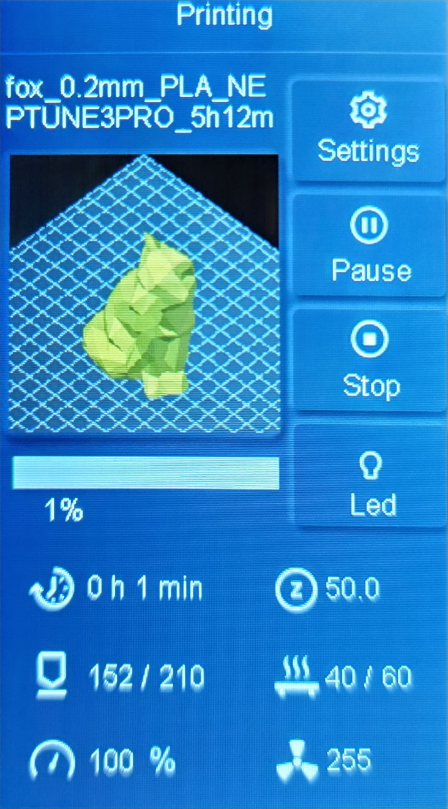

# Elegoo Neptune Thumbnails for PrusaSlicer

PrusaSlicer Post-Processing script to add thumbnails images into gcode files for Elegoo Neptune printers (only tested for 3 Pro).

For now, this package just converts the thumbnail that PrusaSlicer bakes into the gcode file into the format that is read by the Neptune printers.

## Installation

- Download the [latest release](https://github.com/TheJMaster28/ElegooNeptuneThumbnailPrusa/releases)
- Extract the zip to location where the exe can be executed

## How to Setup PrusaSlicer for Post-Process Scripts

> For a more detailed guide [here](https://github.com/TheJMaster28/ElegooNeptuneThumbnailPrusa/wiki/Setup-Post%E2%80%90Process-Scripts-in-PrusaSlicer)

- Go to 'Printer Settings' and change the 'G-code thumbnails' setting to be '200x200'
- Go to 'Print Settings' and under the 'Post-processing scripts' and put the path to the exe

PrusaSlicer should now run the exe when you export the gcode.

## Compatibility

So far I have only tested on my printer, the 3 Pro, and with PrusaSlicer 2.6.0.

I would believe that this package should work with the Plus and the Max. Older printers are not yet supported.

I would also believe that this package should also work on older version of PrusaSlicer.

## Contribution

This repository is based on [Molodos/ElegooNeptuneThumbnails](https://github.com/Molodos/ElegooNeptuneThumbnails) and therefore
released under the **AGPL v3** license.
